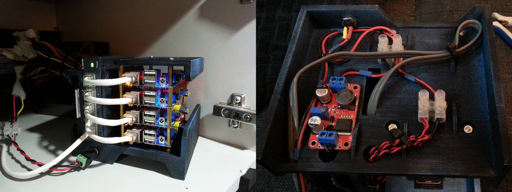
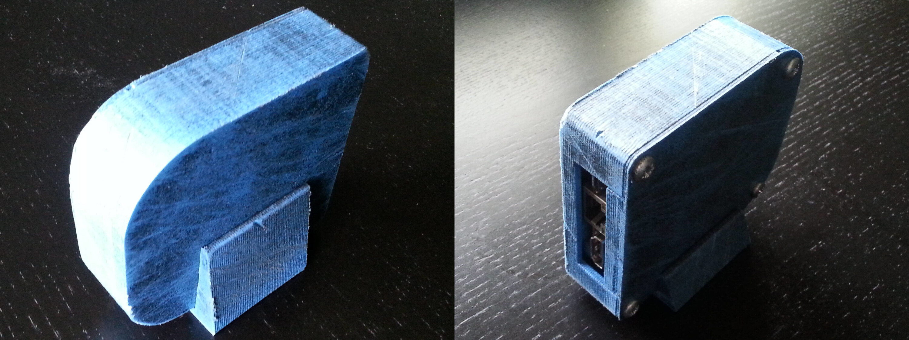
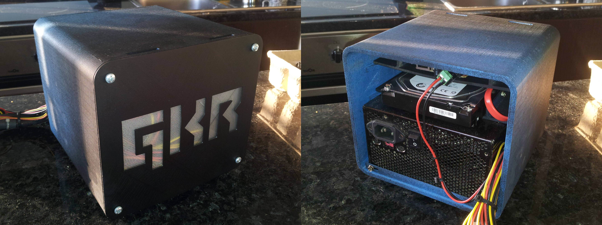

# Zalkeen Node Hardware

Node hardware

## Cluster

## Node Macro

## Node

### Attribuition

**v2**

Based on [NAS case, BanaNAS by snowivis](https://www.thingiverse.com/thing:2676179)
licensed under the GPLv3 license

**v1**

Based on [BanaNAS - SimpleNAS - Case for Banana Pi by cyryllois](https://www.thingiverse.com/thing:460603)
licensed under the CC-BY-SA license

## Node Mini

## Box

## Attribution

Unless otherwise specified, code and objects are released under the *GNU General Public License v3* and *Creative Commons - Attribution-ShareAlike* respectively.

